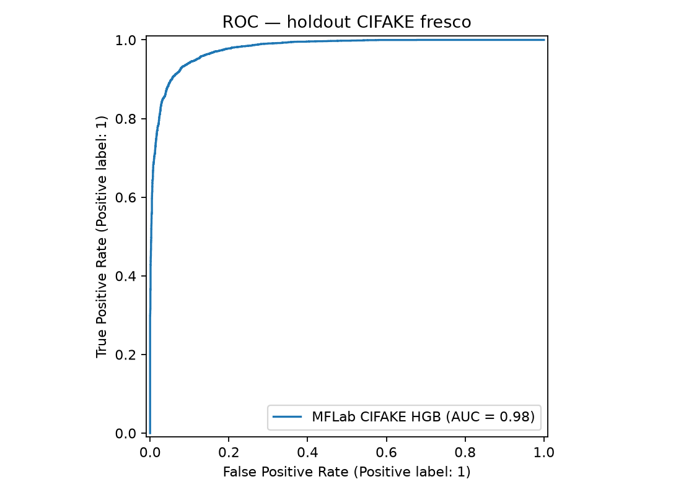
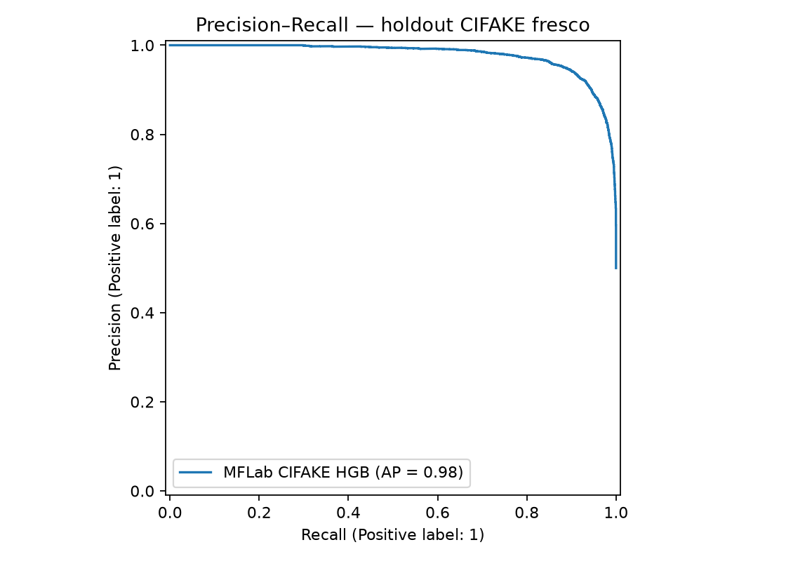
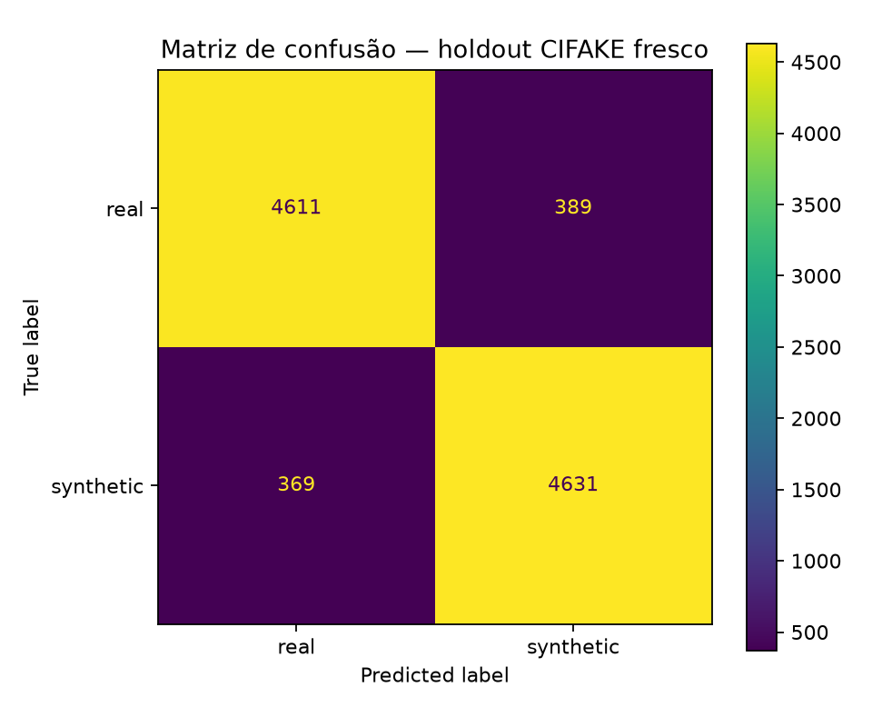
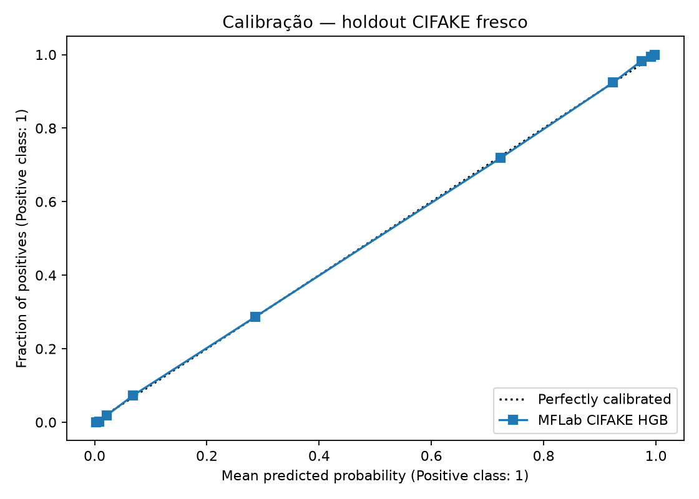

# Media Forensics Lab (Python) - v0.9

Laboratório técnico e de pesquisa para análise reproduzível de integridade, proveniência, manipulação e mídia sintética/deepfake em imagens e vídeos. A v0.9 acrescenta um classificador automático `real`/`synthetic` calibrado e cientificamente escopado, preservando a separação entre **voto computacional** e **conclusão pericial**.

> Regra central: nenhum escore, heurística, mapa, gráfico ou modelo isolado é convertido automaticamente em conclusão pericial. O MFLab separa observações de triagem, classificação automática, modelos validados dentro de um domínio declarado, proveniência, artefatos derivados e interpretação especializada.

## Novidades da v0.9

- modelo embarcado `mflab_cifake_hgb_calibrated_v1`, treinado com o feature bank `synthetic_handcrafted_v2`;
- classificador `HistGradientBoosting` calibrado por sigmoid/CV, exportado como bundle versionado;
- `synthetic_ml` passa a usar o modelo embarcado por padrão, salvo override por `MFLAB_SYNTHETIC_MODEL`;
- novo bloco `machine_assessment` no protocolo `MFLAB-DF-0.7`, contendo `label`, `score_synthetic`, threshold, calibração, modelo e escopo de validação;
- a interface web exibe explicitamente **Classificação automática: REAL / SINTÉTICA-IA**, mantendo separadamente `evidentiary_conclusion`;
- validação do bundle e validade para a entrada atual são conceitos separados: `bundle_validated` não implica automaticamente `validated_for_input`;
- o examinador só confirma aplicabilidade ao domínio por `MFLAB_SYNTHETIC_MODEL_DOMAIN_CONFIRMED=1` quando houver justificativa documental para isso;
- workflow reprodutível de treinamento/validação em CIFAKE, com holdout fresco, relatório JSON/Markdown e gráficos ROC, PR, matriz de confusão e calibração;
- o modelo e seus metadados são empacotados com a distribuição.

A v0.9 **não transforma o MFLab em um “oráculo de IA”**. O modelo embarcado é validado apenas no domínio documentado do CIFAKE e sua classificação permanece triagem fora desse domínio.

## Base AutoGAN da v0.8

A v0.8 introduziu:

- análise `autogan_spectral`, baseada no método de Zhang, Karaman e Chang (WIFS 2019);
- FFT por canal RGB com log-amplitude, normalização robusta P5/P95 e bandas `full`, `low`, `mid` e `high`;
- descritores de energia por banda, autocorrelação de perfis e correlação entre quadrantes;
- `synthetic_handcrafted_v2`, incorporando features AutoGAN-compatible;
- adaptador opcional para checkpoint ResNet34 AutoGAN;
- artefatos visuais AutoGAN integrados à aba **Gráficos e imagens** e ao **Apêndice A** do laudo.

A implementação espectral é uma reprodução independente da metodologia publicada. O MFLab não depende do ambiente antigo do repositório AutoGAN para executar a análise nativa.

## Capacidades de mídia sintética/deepfake

O protocolo `MFLAB-DF-0.7` combina:

1. integridade e proveniência (SHA-256, C2PA, metadados);
2. forense clássica (JPEG, ruído, resampling, PRNU-like, FFT etc.);
3. triagem facial e consistência face-contexto;
4. feature bank sintético (FFT + wavelet + HOG + RGB + GLCM/LBP + AutoGAN-compatible spectral descriptors);
5. análise GAN-específica de artefatos espectrais de upsampling inspirada no AutoGAN;
6. classificador ML handcrafted embarcado e calibrado, com domínio de validade explicitamente registrado;
7. deep detector ONNX opcional;
8. checkpoint AutoGAN/ResNet34 opcional;
9. convergência entre famílias;
10. `machine_assessment` para o voto computacional `real`/`synthetic`;
11. `evidentiary_conclusion`, mantida separada e automaticamente `inconclusive` salvo raciocínio pericial documentado fora do escore automático.

A diferença é intencional:

```text
machine_assessment.label = synthetic
        ≠
evidentiary_conclusion = synthetic
```

O primeiro é uma classificação de máquina. O segundo é uma conclusão de valor pericial, que exige validade de domínio, convergência, proveniência e interpretação do caso.

O AutoGAN continua sendo tratado como método de **GAN upsampling artifact detection**. Um resultado negativo não exclui geração por GAN e, sobretudo, não exclui diffusion ou outras famílias modernas de geração sintética.

## Instalação

```bash
python -m venv .venv
source .venv/bin/activate      # Windows: .venv\Scripts\activate
pip install -e .[test]
```

No Windows, se houver problema TLS com PyPI:

```powershell
pip install -r .\requirements.txt --trusted-host pypi.org --trusted-host files.pythonhosted.org
pip install -e . --no-deps --no-build-isolation
```

O classificador CIFAKE v0.9 é instalado junto com o pacote e não exige variável de ambiente. Para substituir por outro bundle:

```powershell
$env:MFLAB_SYNTHETIC_MODEL="C:\modelos\detector.joblib"
```

Somente quando o examinador tiver fundamento para afirmar que a evidência pertence ao domínio de validação declarado do modelo:

```powershell
$env:MFLAB_SYNTHETIC_MODEL_DOMAIN_CONFIRMED="1"
```

Não use essa variável apenas porque a imagem possui a mesma resolução. Confirmação de domínio é uma decisão metodológica/documental, não um atalho para aumentar o peso de um score.

Opcional para detector profundo ONNX:

```powershell
pip install -e .[deep]
$env:MFLAB_SYNTHETIC_ONNX="C:\modelos\detector.onnx"
```

Opcional para checkpoint AutoGAN-compatible:

```powershell
pip install -e .[autogan]
$env:MFLAB_AUTOGAN_CHECKPOINT="C:\modelos\autogan\checkpoint_10.pth"
$env:MFLAB_AUTOGAN_FEATURE_MODE="full"
```

Metadados opcionais do checkpoint AutoGAN podem ser fornecidos por `MFLAB_AUTOGAN_METADATA`.

Dependências de sistema recomendadas: `ffmpeg`/`ffprobe`, `exiftool` e `c2patool`.

## Análise normal

```powershell
mflab analyze-file imagem.jpg --profile deepfake
mflab analyze-file imagem.jpg --profile full
mflab integrations
mflab web
```

A interface local permanece em `http://127.0.0.1:8765`.

Para uma imagem, o bloco esperado passa a conter algo como:

```json
{
  "machine_assessment": {
    "status": "available",
    "label": "synthetic",
    "score_synthetic": 0.87,
    "decision_threshold": 0.5,
    "calibrated": true,
    "validated_for_input": false,
    "forensic_effect": "screening_only"
  },
  "evidentiary_conclusion": "inconclusive"
}
```

## Cases e artefatos visuais

```powershell
python scripts/make_case.py case-2026-001 --from-demo
mflab analyze-case case-2026-001 --profile full
mflab report case-2026-001 --format docx
mflab report case-2026-001 --format md
```

Estrutura relevante:

```text
case-2026-001/
├── original/
├── results/
├── visuals/
│   ├── img_001_pristine.jpg/
│   │   ├── ela.png
│   │   ├── noise_residual.png
│   │   ├── fft_spectrum.png
│   │   ├── rgb_histogram.png
│   │   ├── synthetic_feature_profile.png
│   │   ├── autogan_fft_full.png
│   │   ├── autogan_fft_low.png
│   │   ├── autogan_fft_mid.png
│   │   ├── autogan_fft_high.png
│   │   └── autogan_spectral_profile.png
│   └── ...
├── final/
│   ├── case-2026-001_laudo_preliminar.docx
│   └── case-2026-001_laudo_preliminar.md
└── report.json
```

No site, a aba **Resumo e métodos** mostra agora a classificação automática em bloco próprio, e a aba **Gráficos e imagens** continua exibindo a galeria derivada. A conclusão pericial automática continua apresentada separadamente.

## Validação nível 1 — CI/regressão

Continua obrigatória em cada mudança:

```powershell
python scripts/check_version.py
python -m compileall -q mf_lab scripts tests
python scripts/build_demo_dataset.py
git diff --exit-code -- dataset/demo/ground_truth.json
pytest -q
python scripts/ci_validate_gt.py --out validation/demo_validation.json
python -m pip check
```

O GT canônico exige 100% de cobertura e 100% de aprovação dos checks obrigatórios da base controlada. Esse 100% é regressão de engenharia, não acurácia universal.

<!-- CIFAKE_V09_START -->
## Classificador automático embarcado e validação CIFAKE — v0.9

A v0.9 inclui o modelo calibrado **`mflab_cifake_hgb_calibrated_v1`**, treinado sobre o `synthetic_handcrafted_v2` (73 features) e embarcado no pacote. O modelo produz um voto computacional `real`/`synthetic` e um score da classe sintética. Esse voto aparece no JSON e no site como **Classificação automática**, mas permanece separado da conclusão pericial `evidentiary_conclusion`.

Para evitar apresentar como "holdout intocado" um conjunto que já havia sido consultado durante o desenvolvimento da v0.8, a validação v0.9 reconstrói o subconjunto de desenvolvimento anterior e reserva, a partir do seu complemento, um **holdout fresco de 10,000 imagens**. O modelo final é ajustado em 90,000 imagens do train original. O teste oficial de 20,000 imagens também é reportado, mas como resultado secundário.

| Avaliação | Accuracy | Sensibilidade | Especificidade | FPR | ROC-AUC | PR-AUC |
|---|---:|---:|---:|---:|---:|---:|
| Holdout fresco primário | 92.42% | 92.62% | 92.22% | 7.78% | 0.9784 | 0.9787 |
| Teste oficial CIFAKE (secundário) | 92.38% | 92.71% | 92.04% | 7.96% | 0.9792 | 0.9795 |

O domínio validado continua estreito: **CIFAR-10 real vs Stable Diffusion v1.4, 32×32**. Para imagens arbitrárias o MFLab ainda gera a classificação automática, mas marca `validated_for_input: false` salvo confirmação explícita do domínio pelo examinador. Isso evita transformar uma boa métrica in-domain em alegação universal de detecção de IA.









Relatório completo: [`validation/scientific/CIFAKE_V09_RESULT.md`](validation/scientific/CIFAKE_V09_RESULT.md). Metadados do modelo: [`mf_lab/models/mflab_cifake_hgb_calibrated_v1.json`](mf_lab/models/mflab_cifake_hgb_calibrated_v1.json).
<!-- CIFAKE_V09_END -->

## Validação nível 2 — benchmark científico

A validação científica genérica continua disponível para datasets externos e explicitamente separados do CI. Exemplo de manifesto:

```csv
path,label,generator,split,transform
D:/datasets/real/001.jpg,real,camera,train,original
D:/datasets/stylegan3/001.png,synthetic,StyleGAN3,train,original
D:/datasets/real/101.jpg,real,camera,test,jpeg_q70
D:/datasets/progan/101.png,synthetic,ProGAN,test,jpeg_q70
```

Execute:

```powershell
mflab benchmark-synthetic .\benchmark\manifest.csv `
  --out .\validation\scientific\benchmark.json `
  --model-out .\models\synthetic_handcrafted.joblib `
  --cross-generator
```

O benchmark genérico treina Logistic Regression, SVM-RBF, ExtraTrees e HistGradientBoosting, seleciona sem usar o test set final e registra desempenho global, por gerador, por transformação e leave-one-generator-out quando possível.

O bundle genérico exportado por `benchmark-synthetic` continua deliberadamente salvo com `validated: false`. O único bundle embarcado marcado como validado na v0.9 é o modelo CIFAKE documentado nesta versão, e mesmo ele só é válido no domínio declarado.

## Separação metodológica

- `dataset/demo` = regressão rápida e determinística do software;
- datasets científicos externos = estimativa de desempenho;
- `machine_assessment` = classificação automática computacional, não parecer;
- `visuals/` = produtos derivados de inspeção, não um terceiro oráculo;
- AutoGAN-compatible spectral analysis = família específica para artefatos de upsampling em GANs, não detector universal de IA;
- validação cross-generator = treino em geradores conhecidos e teste em gerador não visto;
- validação cross-family = por exemplo GAN → diffusion;
- pós-processamento = JPEG, resize, blur, screenshot e reencode.

Nunca altere o ground truth apenas para fazer um detector passar.

## CI/CD e versionamento

O projeto usa SemVer, GitHub Actions em Windows/Ubuntu e Python 3.10–3.12, gate de GT, package smoke e release por tag. Consulte `docs/CI_CD.md`, `docs/SCIENTIFIC_VALIDATION.md`, `docs/VISUAL_ARTIFACTS.md`, `docs/AUTOGAN_INTEGRATION.md` e `docs/METHODS_MATHEMATICAL_COMPUTATIONAL.md`.
